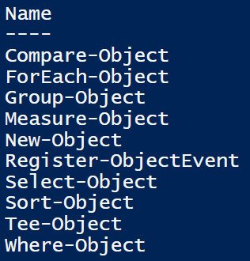
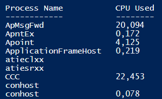
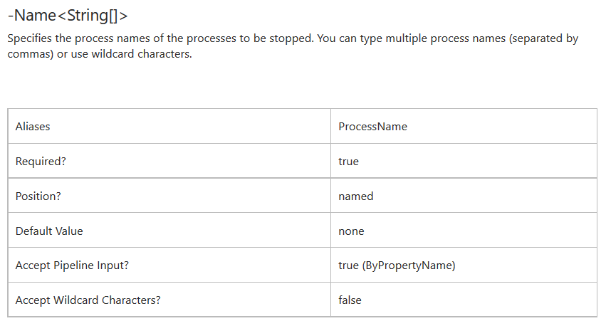
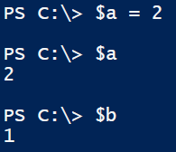
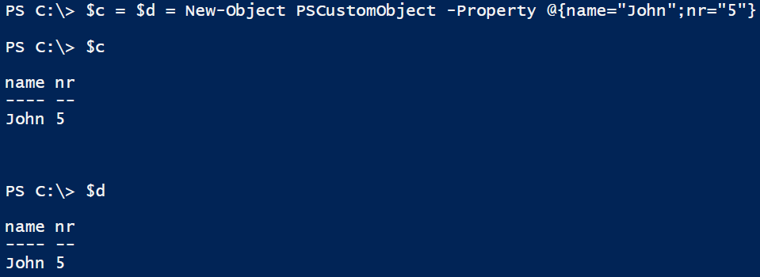

# Basic exercises

These exercises will give you a first overview of PowerShell and introduce some new cmdlets. They don't cover scripting yet.
## Get-member

Trying out a bit more of the members of a process.
* Start a notepad process (only one, not more)
* Get this process
* Get the members of this process
* Get the description of this process
* Get the members of the description of this process
	* The description is a string, and has string-methods like ‘ToUpper()'
* How long is the description?
* Return the description of the notepad process in uppercase

[Solution](Basic_Solutions/Get_member_1.ps1)

Innovation can only come from a small dose of anarchism, since staying on the beaten path has never led anyone anywhere new. That is why most of you will have disliked the sentence "(only one, not more)" in the first exercise.

Therefore, innovate and try this out by starting multiple notepad processes.
* Start multiple notepad processes
* Store them in a variable
* Get the members of this variable
* Get the description of this variable
* Use the "length" property of the description to see how many characters are in the description.

[Solution](Basic_Solutions/Get_member_2.ps1)


## Filtering v2 and v3

Using where-object differs between PowerShell version 2 and version 3. We'll explore this difference with the following exercise.
* Get all notepad-processes using Where-Object version 2-style
* Get all notepad-processes using Where-Object version 3-style
* Get all notepad and calculator-processes in version 2-style
* Get all notepad and calculator-processes in version 3-style
* Get all notepad and calculator-processes without using Where-Object
* Get all notepad and calculator-processes using Where-Object, and the -in operator

[Solution](Basic_Solutions/Filtering_v2_and_v3_1.ps1)

## "Object"-cmdlets

Try to get the following list:



The problem is that you only want the cmdlets from two modules: Microsoft.PowerShell.Utility and Microsoft.PowerShell.Core. There is quite a simple solution, using only the get-command cmdlet. (Note that most parameters can also take an array as value.)

[Solution](Basic_Solutions/object_cmdlets_1.ps1)

But let's make it more interesting. You have to start with:

```PowerShell
Get-Command –name *object* | 
```

Write a where-object-filter after the pipeline that filters these cmdlets.

[Solution](Basic_Solutions/object_cmdlets_2.ps1)


## Stopping processes v2 and v3

Another difference between version 2 and version 3 is how they handle arrays. Any programmer will tell you it's a good idea to execute a method on an object, but impossible to execute a method on an array of object. This is true for v2, but not for v3. Version 3 allows you to execute a method on all items of an array.
* Start one notepad instance
* Get the notepad with "Get-Process" and store it in a variable
* Execute the "kill()" method on the one process
* Try to get the process and execute the method in one line

All this will work in version 2 and version 3. The following however, won't.
* Start two notepad instances
* Get the notepads with "Get-Process" and store them in a variable
* Execute the "kill()" method on both processes
* Try to get the processes and execute the methods in one line

When working in version 2, you need to use "Foreach-Object".
* Get two notepads, and foreach-Object them into oblivion

[Solution](Basic_Solutions/Stopping_processes_v2_and_v3_1.ps1)
## Profiles

PowerShell allows you to work with profiles. The profile, stored in the location "$profile" (which is different for the ISE and the console) doesn't always exist. If it exists, it gets executed whenever opening the ISE or the console.

Your colleague left his computer logged on. He won't be back for at least twenty minutes.
* Check if the profile-script exists
* Create an alias "Get-Service" that refers to "Get-Process"
* Test the alias
* Store the alias in the profile (create it if necessary)
* Remove the alias
* Close and reopen the console, to see if the alias comes back
* …
* Remove the profile script

[Solution](Basic_Solutions/Profiles_1.ps1)

Profiles can be nice if you always need to connect to a certain drive or when you want to change the error colors to make them more readable, but using non-standard aliases is a bad idea. It makes all your scripts unusable on any computer but your own.

There is more than one profile stored in $Profile. Look for these other profiles in the properties of $Profile.

[Solution](Basic_Solutions/Profiles_2.ps1)

One might note there are more profiles than the one shown by $profile.


If you like to make things needlessly complicated, write a one-liner that deletes all these files. Do the same with a script. Note that writing scripts is not covered in these exercises.

[Solution](Basic_Solutions/Profiles_3.ps1)

We trust that, while changing the profile on someone else's computer, you didn't add the following lines:
```PowerShell
$PSDefaultParameterValues.Add('write-host:foregroundcolor',{get-random $([system.enum]::getvalues([system.consolecolor]))})

$PSDefaultParameterValues.Add('write-host:backgroundcolor',{get-random $([system.enum]::getvalues([system.consolecolor]))})
```


It would not be fitting of a real grown-up to do such things…
## Looking for cmdlets

There are a number of ways to look for cmdlets. Apart from simply looking them up on the internet, you can also use the built-in cmdlets.
* Get all commands
* Get all commands starting with Get
* Get all commands starting with Get or Set
* Get all commands ending in "-Service"
* Get all commands with the noun "Service"
* Get the "PowerShell"-command
* Get the "C:"-command
* Get all commands ending in "*.exe"
* Get all command that are actually functions

[Solution](Basic_Solutions/Looking_for_cmdlets_1.ps1)


## Expressions

You can use expressions to calculate values. However, when using these as a parameter with, for instance, Write-Output, they don't always work as expected.
* Type "10 * ( 8+6 )" in a console window
* Get the process with ID 10*(8+6)
* Create a variable name, with a name as value
* Type "Hello" followed by the name in the variable
* Write-Output Hello, followed by the name in the variable

[Solution](Basic_Solutions/Expressions_1.ps1)


## Sorting objects

It's simple to get a list of processes and sort them by name alphabetically. It's also quite easy to sort them by ID when the name is the same, if you want the ID's to be sorted small to large.

It's more difficult, but possible, to sort all process ascendingly by name, and within that list descendingly by ID. "Hey Scripting Guy" has a nice blog about that:

https://blogs.technet.microsoft.com/heyscriptingguy/2016/05/03/the-top-three-tips-for-effective-sorting-in-powershell/
* Sort all processes alphabetically by name
* Sort all processes alphabetically by name, and ascending by ID
* Sort all processes alphabetically by name, and descending by ID

[Solution](Basic_Solutions/Sorting_objects_1.ps1)
## Grouping objects

Every service has a status. This describes whether the service is stopped or running.
* Get all services, and group them based on this status
* Look at the methods and properties of these groups
* Show the name of both groups
* You would expect that showing the values will show the names of all services
* But perhaps looking at the Group-property is more interesting
* What type of objects are stored in the Group-property?

[Solution](Basic_Solutions/Grouping_objects_1.ps1)

It's not always necessary to create a group. Sometimes the PowerShell-equivalent of "SELECT DISTINCT …" is enough. Mainly when you don't want to know how many records are a member of the group…
* Show all different extensions of files in "c:\Windows\System32\".
* How many are there of every type? Sort them descending.

[Solution](Basic_Solutions/Grouping_objects_2.ps1)

## Counting objects

Creating a group and counting the member of the group is a task for "Group-Object". Counting values, and summating them or looking for the minimum or maximum values is more of a task for Measure-Object.
* Get the minimum, maximum, total and average size for all files under c:\Windows (non-recursively).

[Solution](Basic_Solutions/Counting_objects_1.ps1)

The "Out-File" cmdlet will put whatever would have been shown on the screen in a file. It's the equivalent of " > file.txt" in DOS. (There are some difficulties with the width of lines in the file, but generally they are quite the same.)
* Get all processes, and store the list in a file
* Get the content of this file, and count the number of words (or, in this case, the number of groups of characters)
* Same as before, but also show the number of lines and the number of characters

[Solution](Basic_Solutions/Counting_objects_2.ps1)

Using this word-counting is an interesting way to settle the Belgium – the Netherlands for once and for all. We're going to count the words on each countries Wikipedia-page, and the one with most words win.

Reading a website isn't done with "Get-Website". Get-Website exists, but helps configuring an IIS webserver. To read a website, we have to invoke a webrequest.
* Invoke a webrequest to get the Belgian and Dutch Wikipedia-pages in a variable
* Check out one of these to find the correct property of that variable to compare
* Count the number of words in that property of both variables
* Remember that Wikipedia is an open encyclopedia, and that content can be added at all times

[Solution](Basic_Solutions/Counting_objects_3.ps1)

## Teeing objects

A t-crossing is a point where two roads diverge in the wood. For Robert Frost this was a difficult decision to be made because he, one traveler be, could not take both.

In PowerShell however, T-ing an object is the exact opposite. It's not choosing one road for our objects in the pipe, but copying them and sending them down two roads.

In general, this is a bad idea because it creates a complex pipeline. To illustrate we will try the example with variables instead of T's, and achieve the same.
* In one long pipe:
	* Get all processes
	* Store them in file
	* Get only the processes that have used the CPU for more than 1 second
	* Store them in a variable
	* Show name and CPU of these processes in a table
* Now do the same with variables

[Solution](Basic_Solutions/Teeing_objects_1.ps1)

## Last change date of a folder

You have a folder and are wondering when any file in that folder (or subfolders of that folder) has been changed last.

Try to get only the relevant date as a date-object.

[Solution](Basic_Solutions/Last_change_date_of_a_folder_1.ps1)

## Formatting

Because PowerShell is basically a .Net-language, like C#, it can use all the .Net-formatting. However, since we're ‘just' scripting, pretty output is usually not the main concern. We'll explore the possibilities.

You can format any number using the "-f" operator. The following, for example, will format a as a currency with 2 decimal digits:

```PowerShell
"{0:C2}" -f $a
```

The following technet-article describes everything more in detail.

https://technet.microsoft.com/en-us/library/ee692795.aspx
* Let the variable a be a random number between 100 and 999
* Format a as a currency with 3 decimals
* Format a as a number without decimals
* Format a as number with 3 decimals, and make sure it's at the end of a 20 character-long line
* Format a as a number with 3 decimals, and put "some text" 20 characters after the start of a
* Divide a by 1000, and show it as a percentage
* Format a as a decimal number in 8 characters
* What is the hexadecimal value of a?
* What is the binary value of a? (Trick question)

[Solution](Basic_Solutions/Formatting_1.ps1)

Formatting numbers can be useful when used in a table, to make the number more readable. Read up on the following PowerShell tip:

https://technet.microsoft.com/en-us/library/ee692794.aspx
* Create a list of all running processes, shaped like this:



[Solution](Basic_Solutions/Formatting_2.ps1)

## Aliases

PowerShell has a number of predefined aliases. You should be aware of them not only because they cut down on development time, but mainly because scripts and solutions found on the internet will often use them.

When writing a script that will be used for a long time to come, try to put in the extra effort of writing the cmdlets in full. It will improve the readability.
* Get all aliases
* Get the alias that is called when running "gps"
* Get all aliases for "Get-Process"
* Get all aliases that call a cmdlet with "item" in the name
* Create an alias "procs" that calls "Get-Process"
* Get only the "procs" alias
* Export the "procs"-alias to a csv-script (not using Export-CSV!)
* Export the "procs"-alias to a runnable PowerShell-script
* Get all childitems of the drive called "alias:"
* Remove the "procs"-alias
* Run the script you exported earlier
* Remove the "procs"-alias again

[Solution](Basic_Solutions/Aliases_1.ps1)

## Aliases for parameters

Some parameters of cmdlets also have their own aliases. En example is the computername-parameter for Get-Process. You can use "computername" of "cn" to get the processes of another computer than your current computer.
* Get the processes on your own computer (called "." or period) using -cn and using -computername
* Get the members of the Get-Process cmdlet
* Use Select-Object to select only the parameters
* Expand the property parameters
* Get from this result the computername-property
* Get from the computername-property all aliases
* Or, look at the online help-page for Get-Process for aliases for computername

[Solution](Basic_Solutions/Aliases_for_parameters_1.ps1)

## Common parameters

All cmdlets are derived from the same base class, and so have the same common parameters. They can be used for a dry run ("what if I were to execute this") or for debugging purposes.

There is a help page in the common parameters called "about_CommonParameters".

Later on, we will be adding these parameters to our own scripts, to modify their behavior. For now, we'll use them on the existing cmdlets.
* Look at the help for Get-Eventlog
* Also, show the command Get-Eventlog
* Finally, get help about all parameters of Get-Eventlog

[Solution](Basic_Solutions/Common_parameters_1.ps1)

* Look at the output of "c:\","c:\tmp","c:\" |Get-Item . It shouldn't show an error.
* Now replace "c:\tmp" with "c:\not an item". You get an error.
* Set the action to perform on error to "SilentlyContinue". Try again.
* Set the action to perform on error to "SilentlyContinue", and store the error in a variable "wrong". Try again.
* Look at the contents of "$wrong". Why isn't the error displayed in red?
* Look at the contents of "$Error". Have you been a good scripter this session?

[Solution](Basic_Solutions/Common_parameters_2.ps1)

Setting permissions on files is difficult even in PowerShell. The following code creates a file and makes it inaccessible.

```PowerShell
New-Item -Path "c:\tmp\dont read me.txt" -ItemType file
Set-Content -Path "c:\tmp\dont read me.txt" -Value "Supersecret"

$acl = Get-Acl -Path "c:\tmp\dont read me.txt"
$acl.SetAccessRuleProtection($true, $false)
$acl | Set-Acl -Path "c:\tmp\dont read me.txt"
```

* Check to see what would happen if you were to delete the file using -whatif
* Actually try to delete the file
* Force the deletion using –Force
* Try to delete the file in a ISE ran as administrator

[Solution](Basic_Solutions/Common_parameters_3.ps1)

Fixing this file is a problem we will solve later on.

## External commands

You can use any existing external command in PowerShell. The result will be a string, that you look through with the Select-String cmdlet.
* Execute ipconfig /all from within PowerShell
* Look at the members of the resulting object
* Get all strings with "IPv4" in them
* Use the proper cmdlet to get all IP-addresses from your computer

[Solution](Basic_Solutions/External_commands_1.ps1)
## Preference list

We've already noticed that an alias has precedence over a cmdlet. But does an alias win against a function?
* Create a function ‘tmp' that gets all childitems from c:\Windows
* Create an alias tmp that starts notepad
* Check which of both is run

[Solution](Basic_Solutions/Preference_list_1.ps1)

## Propertysets and scriptproperties

Processes have both property sets and script properties.
* Filter the output of Get-Member to show only these
* Show the original property that "product" refers to
* Show all properties that are contained in "psResources" in a table

[Solution](Basic_Solutions/Propertysets_and_scriptproperties_1.ps1)

## Piping unpipeable properties

Some properties can't be piped ‘into' a cmdlet. "-Name" with Stop-Process is an example of this. We see this when we execute "Get-Help Stop-Process –online".



It doesn't accept pipeline input, only by property name. So when you have a list of processnames and want to stop all these processes, you have to make sure they are defined as "Name", not just an incoming string.
* Use "Get-Process" to get all Iexplore-processes, and pipe these into "Stop-Process". This should work.
* Use "Get-Process" to store all iexplore-processes in a variable. Use this variable with the parameter "-InputObject" with "Stop-Process". This should also work.
* Use "Stop-Process", and fill in the "-Name" parameter with "Iexplore". That should also stop internet explorer.
* Pipe the text "IExplore" into "Stop-Process". That won't stop anything.
* Create a "System.Management.Automation.PSObject" (New-Object), and add the member "Iexplore" in the noteproperty called "Name" (Add-Member). Pipe this object into Stop-Process. Should work!

[Solution](Basic_Solutions/Piping_unpipeable_properties_1.ps1)

## Comparing [lists of] objects

The "Compare-Object" cmdlet compares two inputobjects, and shows where they are different and, if requested, equal. It doesn't, however, always work the way you could expect.
* Store a list of all processes in a variabele named a
* Start notepad
* Store a list of all processes in a variabele named b
* Compare both lists, and see if you can find the difference

Up until this far, everything should work as expected.
* Start notepad (or use the existing, running notepad)
* Store a list of all processes in a variabele named a
* Copy a lot of text inside the notepad
* Store a list of all processes in a variabele named b
* Filter lists a and b to see if there's a difference between both notepad processes (there should be, the number of handles will be bigger)
* Compare both lists again, and see if you can find the difference

There won't be a difference. The process is present in both lists and Compare-Object doesn't look at the properties of the objects. You could stop this exercise here, or you could keep on digging.
* Get only the notepad processes from a and b (and store in n1 and n2)
* Do a compare-object on both (hint: doesn't work)
* What are the member of n1.name?
* Use the ‘CompareTo'-method of n2.handles!
* Use the ‘-property' parameter with compare-object to compare the name and handles for n1 and n2

And now you have found it, but only for one property at a time. You could stop now, or…
* Write a function that compares all properties of two objects

[Solution](Basic_Solutions/Comparing_lists_of_objects_1.ps1)

## Output

PowerShell has a lot of different ways to output information. In the following exercises we'll cover some of them, always using all processes as the inputdata.
* Format all processes in a table, showing the id, procesname and the property beginning with "working", but you can't remember what came after.
* Get all processes, but don't print them. There are three ways to suppres output:
	* Store it in a variable
	* Send it to Null
	* Cast it to void
* Print all processes to the default printer.
* Print all processes to the "Microsoft Print to PDF"-printer.
* Save a processes in a file called "processlist.txt"
* Append all the processes to the same file
* Show all commands with paging (look at the parameters of out-host)

[Solution](Basic_Solutions/Output_1.ps1)

## Multiple assignments

Did you know it is possible to assign multiple variables at once?


And, predictably, changing one variable won't change the value of the other.



Suppose we make a new PSCustomObject with two properties, and assign this to two variables…



Will that behave the same?

[Solution](Basic_Solutions/Multiple_assignments_1.ps1)

Hallo...

